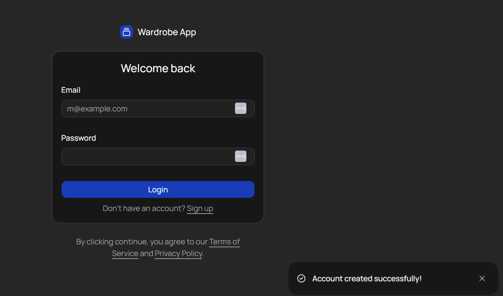

#  Sign Me Up!
Welcome to **day 256** of 365 days of code - coding every day for a year, little and often

Another short day today, but I got all of the signup logic in place and I'm now able to sign up to the app, but that's about all I can do so far. There was a fair amount of copy and paste logic from Tempus, but one or two small changes. The big one was that Shadcn have dropped Sonner and now have their own Toast implementation. That meant I couldn't just roll with my previous Sonner logic as not all of the options are available in the Shadcn Toast, for example there are no postions, it's all just bottom right. That's not the end of the world, but I hope they add the option soon.

Anyway, it's all working and that's what matters, tomorrow will be the login logic, that should hopefully be pretty straight forward...

> [!NOTE]
> For this project I won't be copying the whole codebase into this repo every time I work on it, instead I'll just [link to the repo](https://github.com/ASam08/wardrobe-app) and even link [direct to the commit here](https://github.com/ASam08/wardrobe-app/commit/1783ab138ea64d654a42e5e2bd1bcab168b7727a) if someone wants to go have a look at that point in time.

