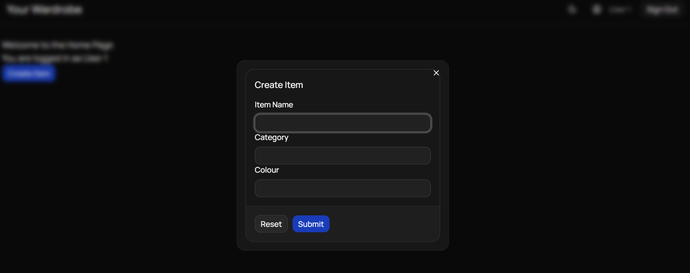

#  React Hook Forms
Welcome to **day 263** of 365 days of code - coding every day for a year, little and often

Ok, so today was spent diving into React Hook Forms. Honestly with Tempus, I just used native forms, did all the validation manually, in multiple places etc. but I'd heard about React Hook Forms and wanted to give it a go. I spent a fair bit of time reading about it, and ended up going through the ShadCn example for it and having a crack. I'm really please with how it works and has come out from a UI perspective so far. It's not perfect, and doesn't have everything in it, it's just me playing around and having a crack, so definitely a day 2 needed on it. My time today was really limited again so it's good to just get something out.

Anyway, I also haven't forgotten Tempus, there were some package updates to do today via dependabot, so I checked those all through and merged the PR, then pushed a release out for them as well.

That's more than enough for today, more tomorrow!

> [!NOTE]
> For this project I won't be copying the whole codebase into this repo every time I work on it, instead I'll just [link to the repo](https://github.com/ASam08/wardrobe-app) and even link [direct to the commit here](https://github.com/ASam08/wardrobe-app/commit/9aff66710f552fa1f765643852943c2189cda7b3) if someone wants to go have a look at that point in time.

