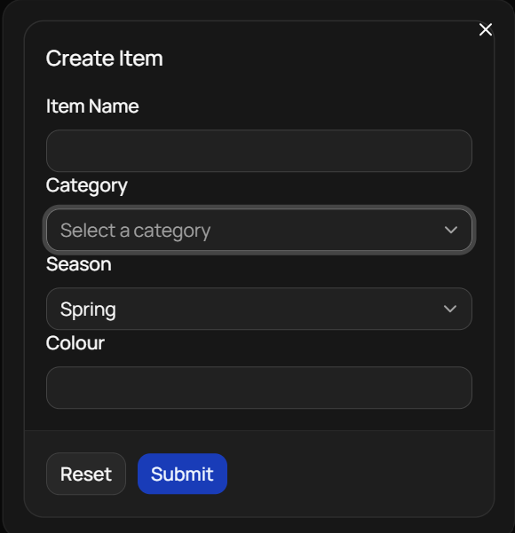

#  Filling Out The Form
Welcome to **day 264** of 365 days of code - coding every day for a year, little and often

Sometimes I'm more proud of these daily update titles than I should be...

Today was spent filling out the create item form more, working on adding a select for the season and a combobox for the category. The idea with the combobox is it will work as an autocomplete, allowing the user to add another category if it doesn't exist for them already.

The select wasn't too bad, I just had to get my head around the way I had to format things for react-hook-forms to work. Once I had done that, it made adding the combobox even easier. I was just using dummy arrays for the seasons and categories for testing the UI and function, and then wired in the combobox to retrieve the categories from the DB.

That was more than enough for the time I had today, so I'll have to work on standardising the seasons list tomorrow!

> [!NOTE]
> For this project I won't be copying the whole codebase into this repo every time I work on it, instead I'll just [link to the repo](https://github.com/ASam08/wardrobe-app) and even link [direct to the commit here](https://github.com/ASam08/wardrobe-app/commit/f7aacfa59830da80ae374820cfca5a9e4e711fd5) if someone wants to go have a look at that point in time.

