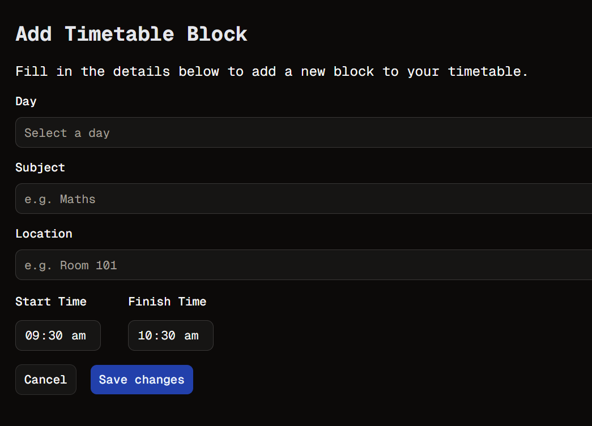

# Just Get It Working
Welcome to **day 28** of 365 days of code - coding every day for a year, little and often

So today I had planned to get back to the timetable app, and I did, but first...

I found an issue today when creating my folder and this .md file for the day. It turns out I had not properly tested my script and it was trying to recreate day 27 again (and replacing the md file for yesterday). In the end it was treating the day number as a string not as an integer, so adding 1 to it was doing nothing. Not a tough fix, but a good lesson.

Anyway, today I decided to move the timetable block form away from the dialog box and onto it's own page. Yes I can and should learn how to make this work, no today isn't that day and I honestly just want to get to the point where this is usable.

So I shifted it to it's own page, added in the location field (which I had forgotten), made a change to the DB tables as I had set them up weird and it didn't really make sense to create the timetable block, and then assign and entry with the subject and location to that block separately, and even spent some time looking at some responsive design stuff on the time table page, changing the headers of the timetable table (?) from long to mid to short day names depending on the screen size. I definitely need to spend a bit more time doing this, and do a better job of thinking mobile first when I'm writing this app, so it was good to spend a little bit of time on it.

Anyway, that's all for today, more tomorrow!

> [!NOTE]
> For this timetable project I won't be copying the whole codebase into this repo every time I work on it, instead I'll just [link to the repo](https://github.com/ASam08/timetable-app) and even link [direct to the commit here](https://github.com/ASam08/timetable-app/commit/b596d4e98ba5453802b4aaafd224241a6c8d11e0) if someone wants to go have a look at that point in time.

