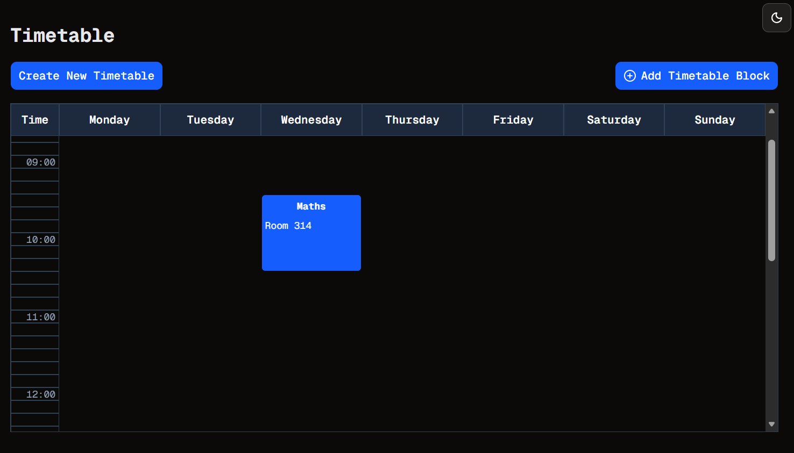

# It's a Grid
Welcome to **day 29** of 365 days of code - coding every day for a year, little and often

Today I have finally gotten the timetable grid working. It was frustrating and a pretty steep learning curve. I initially was looking at a package that could do alot of it, but it was pretty heavy and complex and did alot more than I needed it to. So after a bit of digging I found a way of doing it just with CSS and JS. 
Full disclosure: I am fairly confident I know how it's all working, but there is a bit of copy and paste from google going on so I may not have it all completely down.

Anyway, after tinkering with it to get it going, running into and learning all about the correct flow for server and client functions in the render tree, I then clicked that I needed to convert the day of week from a string to a number stored in the DB, so a bit of work to get that done and voila. It (mostly) works.

I do have to do more testing to make sure it works ok, and I guess some validation to make sure they don't overlap, and create a flow for editing or deleting blocks, but there is progress, and at a very base level, it's kind of working, so I'm pretty pleased with that.

Anyway, tune in again tomorrow for more folks.

> [!NOTE]
> For this timetable project I won't be copying the whole codebase into this repo every time I work on it, instead I'll just [link to the repo](https://github.com/ASam08/timetable-app) and even link [direct to the commit here](https://github.com/ASam08/timetable-app/commit/bb1436a0cb2644361a381c3cf7e26a844ae28e7a) if someone wants to go have a look at that point in time.

