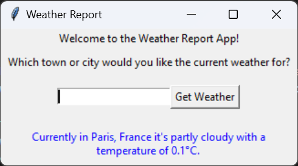

# Get Out of the Command Line
Welcome to **day 3** of 365 days of code - coding every day for a year, little and often

Ok, going back to [day 1](https://github.com/ASam08/365-days-of-code/blob/main/day-1/day-1.md) and I wanted to have a crack at creating a GUI for this, nothing to complicated, as I've never done a GUI through python before. After a bit of googling, I settled on tkinter as it was part of the base python package.

After a bit of tinkering, pulling of hair for the layout etc. I've got something that is basic but functional, albeit not the prettiest thing in the world.

As with day 1, to replicate, create a .env file with a WEATHER_API_KEY which you can get from signing up for free with [WeatherAPI.com](weatherapi.com).