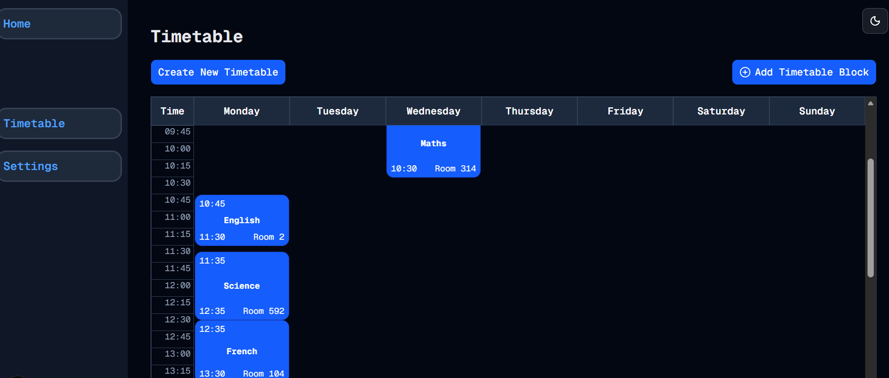

# We Have Data
Welcome to **day 30** of 365 days of code - coding every day for a year, little and often

Well we finally have a timetable, with data, and it works.

It's not yet exactly how I want it to look. I have a few things on my to-do list for it:
- Add a horizontal line to show the current time
- Highlight the current day column
- Different colours based on the subject (this is probably a bigger piece of work, given I want to make the colours choosable by the user)

But it works, and I'm pretty chuffed with that.

Because I had some time and I didn't really want to takle anything on that list above (it's working, don't touch it, don't look at it philosophy), I also started working on the dashboard card for the "Where should I be right now" info. I need to spend some time understanding how I'm best to use the client current time to feed into the DB query, but that is all a future me problem. Once I've worked that out, I'm hoping that the "Where should I be next" card will be relatively straight forward.

Anyway, that's more than enough for today, more tomorrow!

> [!NOTE]
> For this timetable project I won't be copying the whole codebase into this repo every time I work on it, instead I'll just [link to the repo](https://github.com/ASam08/timetable-app) and even link [direct to the commit here](https://github.com/ASam08/timetable-app/commit/7e0bfc0a9ef838849457974d80f98517dde07d64) if someone wants to go have a look at that point in time.

