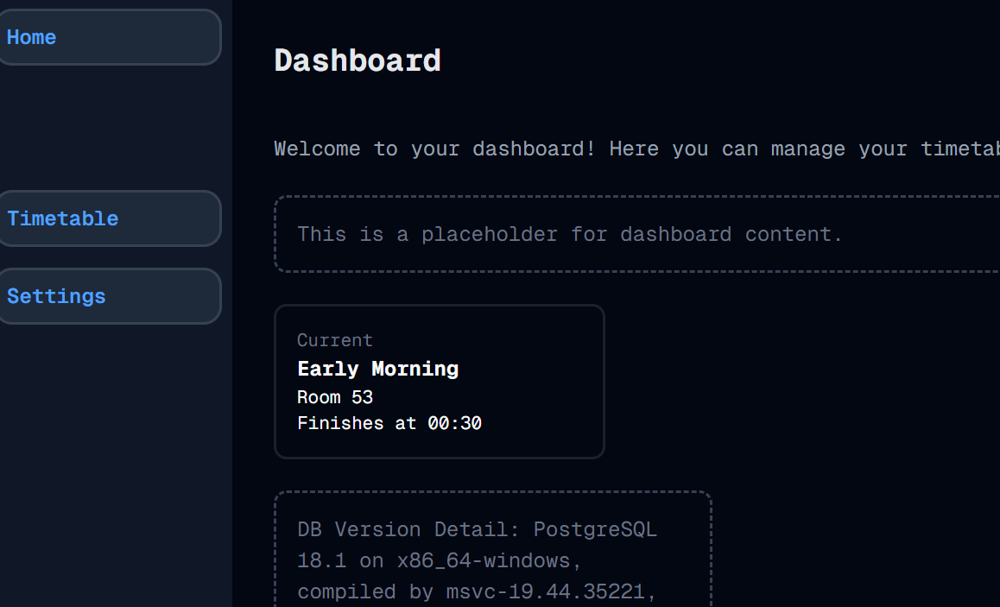

# I Now Know Where I Am
Welcome to **day 30** of 365 days of code - coding every day for a year, little and often

Sometimes something is so frustrating, that you turn to chatGPT, and whilst if fixes it, it creates a problem that has you turning around and around in circles. When it finally clicks, it's infuriating, but rewarding to have found the tiny tiny problem stopping everything working. Sound familiar?

Anyway, after the frustration described above, I finally have the current card piece working, and I'm pretty stoked if I'm honest. Once I add a card for "What's next", and sort out the auth, then I actually have a v1 functioning app!

Those particular tasks are jobs for other day(s), but it's good to have the breakthroughs of the last few days and to almost be there with something usable.

More tomorrow!

> [!NOTE]
> For this timetable project I won't be copying the whole codebase into this repo every time I work on it, instead I'll just [link to the repo](https://github.com/ASam08/timetable-app) and even link [direct to the commit here](https://github.com/ASam08/timetable-app/commit/8583b968b077bdaba05ca7429498af8d412f70b4) if someone wants to go have a look at that point in time.

