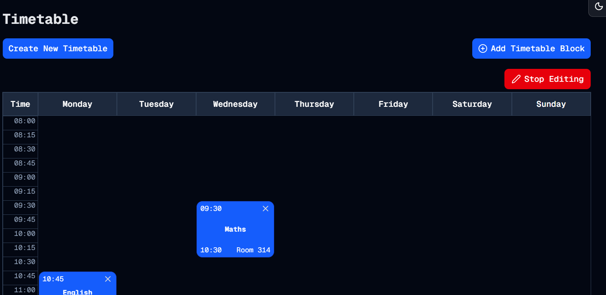

# Delete Delete Delete
Welcome to **day 32** of 365 days of code - coding every day for a year, little and often

I probably could have gone straight from the success yesterday and created the "what's next" card, but I realised there was something else that I needed to get in place, the ability to delete. I don't want to add a timetable block and then it just be there...forever.

So I wrote up the backend for the db action, then added a little x marks the spot to the cards. I then got a chance to put in to practice the stuff I've been learning with states etc. over the last few days and made it so that the delete x only appears when the timetable is in "edit" mode.

And it works! Relatively straight forward today, not much hair pulling or frustration, it just works. I have some things I would like to tidy up, but it seemed a bridge too far today:
- Move the button so that it is part of the page file instead of the timetable file, or otherwise make it so that it can be inline with the create block button.
- Add a true edit option, instead of just delete and then add a new one to replace the mistake you made. This should spit back to the form with all the options pre-filled, something that will take a little more focus for me.

Anyway, that's enough for today, more tomorrow!

> [!NOTE]
> For this timetable project I won't be copying the whole codebase into this repo every time I work on it, instead I'll just [link to the repo](https://github.com/ASam08/timetable-app) and even link [direct to the commit here](https://github.com/ASam08/timetable-app/commit/3ee35ec3d5b3969170175274399b9dff3b80e4c4) if someone wants to go have a look at that point in time.

