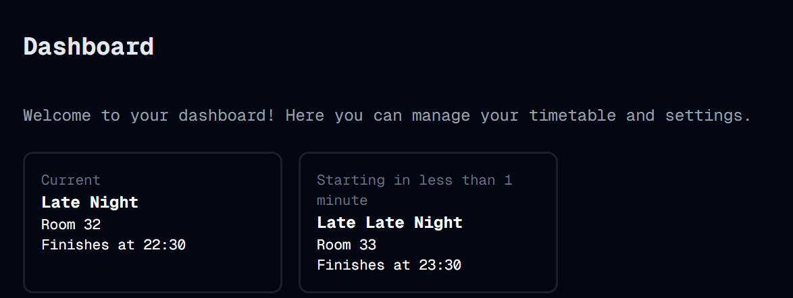

# What's Next?
Welcome to **day 33** of 365 days of code - coding every day for a year, little and often

Today I added in the "what's next" card to the dashboard. Replicating the logic and look from the current card was pretty straightforward, but I wanted it to also have the countdown "2 minutes until..." etc. After a bit of trial and error, I've got that in now too and I'm pretty chuffed with how it looks and feels, although I don't know what the standard is for when you change from 5 minutes to 4 minutes, do you do it at the start of the 10:55, or at 10:56, or halfway between? I've gone with the first option, but it's easy enough to change if needs be.

Anyway, I think I'm pretty much there to be able to say this is MVP ready, just a bit of tidy up to remove some of the stuff I did for testing and debugging, and then it will be ready to roll. That's probably a job for tomorrow...

> [!NOTE]
> For this timetable project I won't be copying the whole codebase into this repo every time I work on it, instead I'll just [link to the repo](https://github.com/ASam08/timetable-app) and even link [direct to the commit here](https://github.com/ASam08/timetable-app/commit/ee054947aff3fef491f34988955dd61507880955) if someone wants to go have a look at that point in time.

