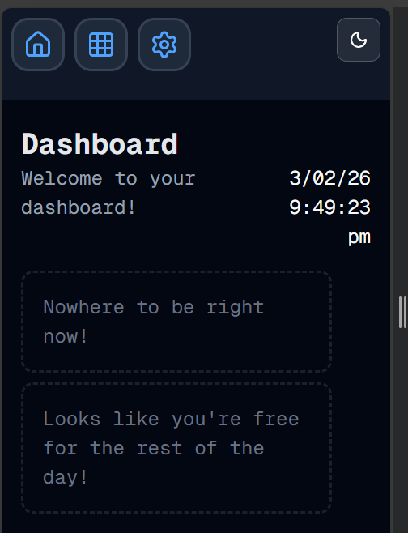

# Make It Responsive
Welcome to **day 34** of 365 days of code - coding every day for a year, little and often

Today was a chance for some tidy up of some of the debugging and console logs that I have put in there during the initial build, but the main focus was actually on responsive design.

99 times out of 100, I plan to use this on my phone, so making it look nice for a laptop, and then having it look like crap on my phone isn't going to cut it, so it was time to change things. I know, I know, I should have been thinking about it as I went, and now I know better (but probably will still forget from time to time).

Anyway, I'm pretty happy with how things are looking now, including getting the timetable to scroll nicely and keep the header and time columns sticky whilst the content scrolls, it looks pretty tidy to me.

That's enough for today though, more tomorrow.

> [!NOTE]
> For this timetable project I won't be copying the whole codebase into this repo every time I work on it, instead I'll just [link to the repo](https://github.com/ASam08/timetable-app) and even link [direct to the commit here](https://github.com/ASam08/timetable-app/commit/a2b803d9ebe00564ae6e6c09deb8be8db3a98c8c) if someone wants to go have a look at that point in time.

