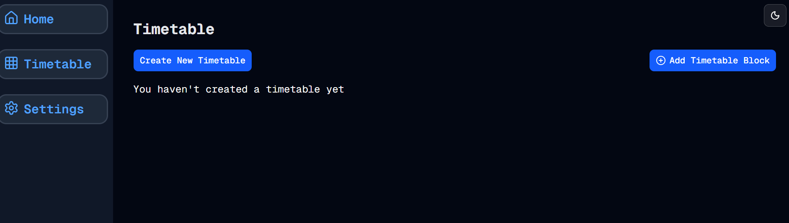

# Docker - It's Alive!
Welcome to **day 37** of 365 days of code - coding every day for a year, little and often

Ok, I found the issue, it was a silly little thing that I really should have found earlier, but clearly yesterday was not my day. Anyway, we're up and running with the docker version and it all looks good so far, so I'm pretty stoked about that.

Seeing the app with an empty DB has revealed a few flaws though that I would like to fix:
- The add timetable block option is still available, clearly if you don't have a timetable created, you can't create a block.
- If there is no timetable set, the create a timetable form probably shouldn't be hidden, so that's something to look at as well.

Not things I'll be fixing today, but something for the future. Who knows, maybe tomorrow?

> [!NOTE]
> For this timetable project I won't be copying the whole codebase into this repo every time I work on it, instead I'll just [link to the repo](https://github.com/ASam08/timetable-app) and even link [direct to the commit here](https://github.com/ASam08/timetable-app/commit/0348b5dc48564e039e49123a8cd28801febcbdca) if someone wants to go have a look at that point in time.

