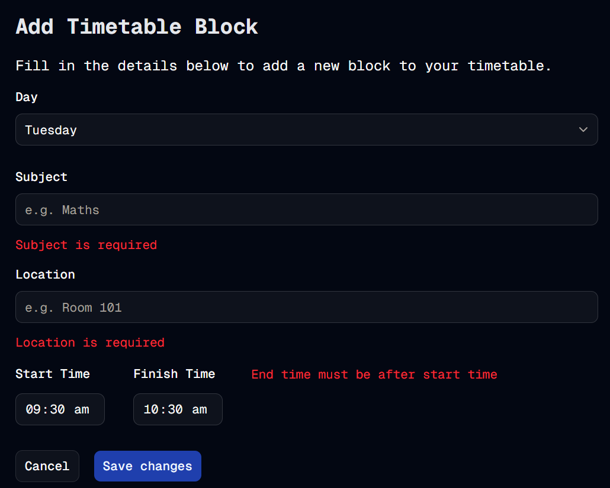

# Error Validation
Welcome to **day 39** of 365 days of code - coding every day for a year, little and often

A short and sweet one today as I haven't had a whole ton of time.

I wanted to start getting stuck into the error validation stuff in the add timetable block form. The first part was to stop it being possible to enter an end time that was before a start time (thankyou Zod).

Next I wanted to provide some user feedback when there is an issue to say what the problem is, thankfully this isn't too painful to do! I have run into an issue because the state could be null, and I will need to look at that as it will break outside of dev, so pushing just to a separate branch for today's changes.

Anyway, more tomorrow, hopefully fixing that issue!

> [!NOTE]
> For this timetable project I won't be copying the whole codebase into this repo every time I work on it, instead I'll just [link to the repo](https://github.com/ASam08/timetable-app) and even link [direct to the commit here](https://github.com/ASam08/timetable-app/commit/2f9e2879c8a80aa9fe25a1cc21bae20e6d8ff6e7) if someone wants to go have a look at that point in time.

