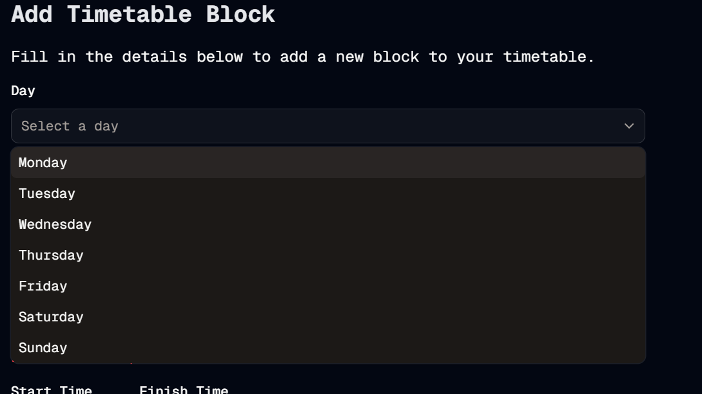

#  Choices Choices
Welcome to **day 40** of 365 days of code - coding every day for a year, little and often

I didn't have a whole lot of time today, so I picked what I hoped would be a quick fix. It's bothered me for a while that the dropdown for the day picker when adding a block has always shown the empty value in the dropdown, and I wanted rid of it.

It turns out it was the complexity of trying to show a day name to the user but return the day number to the function, and the easiest solution was to move away from a combobox and to a select dropdown instead. To be fair this was a pretty quick change and reduces complexity in the code where it probably wasn't needed so I'm pretty happy with the result.

I'll be adding it to the feature branch I'm working on for the validation, and it can be included as part of that merge later on down the track.

Anyway, more tomorrow!

> [!NOTE]
> For this timetable project I won't be copying the whole codebase into this repo every time I work on it, instead I'll just [link to the repo](https://github.com/ASam08/timetable-app) and even link [direct to the commit here](https://github.com/ASam08/timetable-app/commit/3bf2b586efa774f5cc54ef2fbe709accb4befd0d) if someone wants to go have a look at that point in time.

