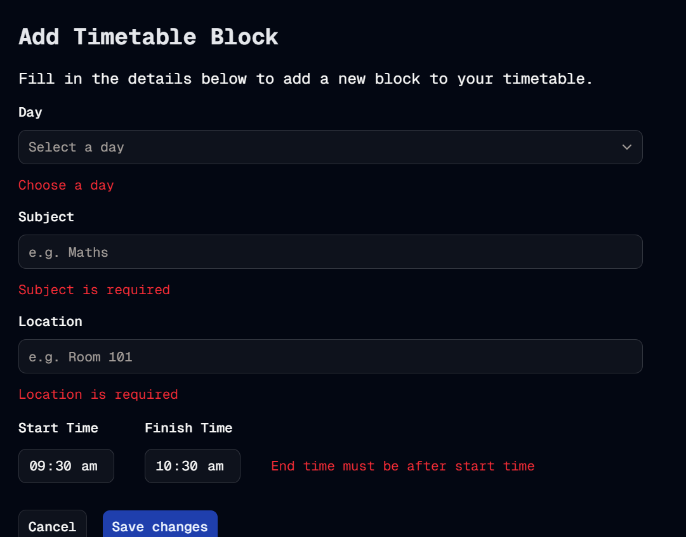

#  Validation Vindication
Welcome to **day 41** of 365 days of code - coding every day for a year, little and often

Well today I finished up all the work on the error validation for the add timetable block form. You now get validation and handy error messages if you misfill the form anywhere. As part of this, the form retains the existing data you had entered so that you can correct it. The only piece I haven't worked out is how to get it to retain the times entered, but that's something I can keep looking at.

As part of the changes, I also have hidden the add timetable block button if there are no sets found, and if you try to navigate straight to the url, and no sets are found, it will bounce you back to the timetable page as well.

I'm pretty happy with the changes, always more to tinker with but it's coming together nicely. The other piece I want to sort out for validation is checking if it will crossover with another block, but I suspect that's a much bigger piece of work...

Anyway, more tomorrow, probably not on validation for a few days.

> [!NOTE]
> For this timetable project I won't be copying the whole codebase into this repo every time I work on it, instead I'll just [link to the repo](https://github.com/ASam08/timetable-app) and even link [direct to the commit here](https://github.com/ASam08/timetable-app/commit/f14989f8024caa62d2d8644f062de78f0547adc2) if someone wants to go have a look at that point in time.

