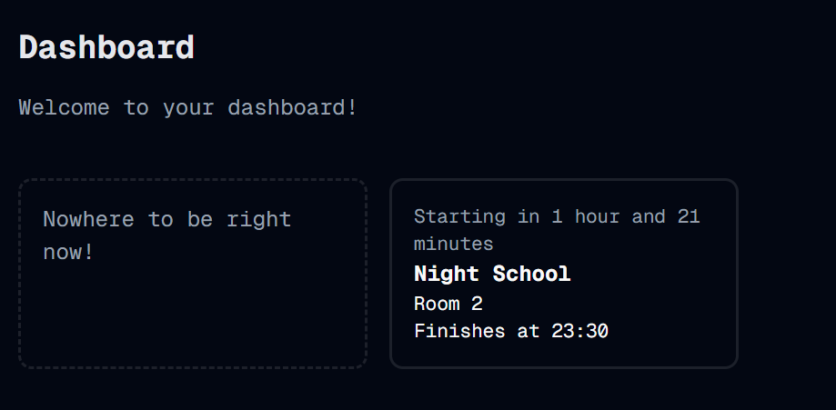

#  Hours And Minutes
Welcome to **day 42** of 365 days of code - coding every day for a year, little and often

So something that has been bothering me for a few days is that the next block card is showing the countdown in minutes only. When it's less than an hour, that's great, but seeing "Starting in 217 minutes" looked pretty shoddy. So today I've done some work to chop that into hours and minutes, and it looks great.

While I was there, I also thought that having the cards call the server every second to check the data was a really bad idea, so I've changed that up too, not it queries it once, then works sets the next interval to be the time between now and the next change. Not a noticible change, but definitely needed.

Tune in again tomorrow folks.

> [!NOTE]
> For this timetable project I won't be copying the whole codebase into this repo every time I work on it, instead I'll just [link to the repo](https://github.com/ASam08/timetable-app) and even link [direct to the commit here](https://github.com/ASam08/timetable-app/commit/e2025a77092f574774d82f987ad02b9d839358a9) if someone wants to go have a look at that point in time.

