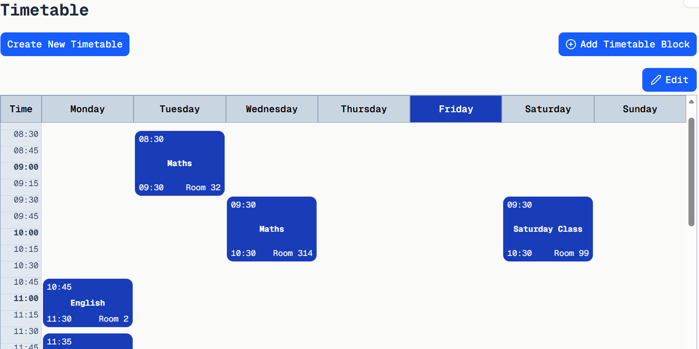

#  Break Time!
Welcome to **day 44** of 365 days of code - coding every day for a year, little and often

No, I'm not taking a break from this, I'm only 44 days in! I've been thinking that it would be nice to show on the dashboard when the next break between blocks is, so I have started to work on that. I got to test my memory on my SQL query skills and have gotten that all written up and the function created there. I just need to put the card together for it, and work out how to not show it if the current card is showing that there is no active block. Something for tomorrow.

In addition, and a bit backwards, I actually started the day off by making a few changes to the timetable page in light mode (I'm generally a dark mode fan), so now in light mode it looks more...light?

Anyway, enough for today, more tomorrow!

> [!NOTE]
> For this timetable project I won't be copying the whole codebase into this repo every time I work on it, instead I'll just [link to the repo](https://github.com/ASam08/timetable-app) and even link [direct to the commit here](https://github.com/ASam08/timetable-app/commit/248181df784d6ea5777661ef10bb3e3d679e3cb6) if someone wants to go have a look at that point in time.

