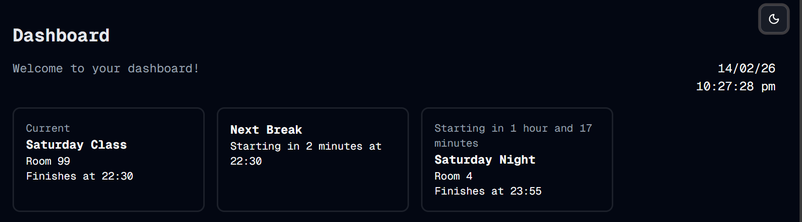

#  Next Break
Welcome to **day 45** of 365 days of code - coding every day for a year, little and often

These cards are getting easier and easier to add in, after getting the query in place yesterday, today was just a case of replicating the card from the others, with a few tweaks, a few things I overlooked in the query to make things tidier and we are done.

I do want to have a think about creating some shared component for these cards, as there's alot of duplication of code, something maybe to look at in the next few days. I also need to think a bit more about the UI of these cards as it's not very consistent from a content and layout perspective.

Anyway, more tomorrow, see you then!

> [!NOTE]
> For this timetable project I won't be copying the whole codebase into this repo every time I work on it, instead I'll just [link to the repo](https://github.com/ASam08/timetable-app) and even link [direct to the commit here](https://github.com/ASam08/timetable-app/commit/abcecd02fadd6d4868a89afc8d7bdc10ea8e034f) if someone wants to go have a look at that point in time.

