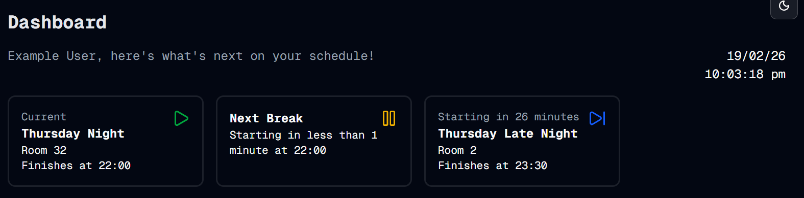

#  Auth Time - Part 5
Welcome to **day 50** of 365 days of code - coding every day for a year, little and often

Day 50, that's not too shabby so far, and I can honestly say my knowledge, skills and confidence has come a long way in just 50 days. This current timetable project wasn't something I'd even thought about at the start of this, and it's only come about to fix a painpoint that I have, so I'm pretty happy with that.

Today I went through and fixed the cards issue on the dashboard that I created yesterday. It's been a good chance for me to see how this could have been done better from the start, and a cool learn about using return responses outside of data or null to govern actions on the client side.

Because I was messing with the cards, I also added some icons to the cards to make them look a bit nicer and more obvious what each one is. I know I should have done that as part of a separate branch, but I didn't, don't hate me for it.

Anyway, that's it for today, maybe tomorrow I'll finally get on to the signup piece...

> [!NOTE]
> For this timetable project I won't be copying the whole codebase into this repo every time I work on it, instead I'll just [link to the repo](https://github.com/ASam08/timetable-app) and even link [direct to the commit here](https://github.com/ASam08/timetable-app/commit/d52bc52085d6018eb624c13391686b29ccfe4b0e) if someone wants to go have a look at that point in time.

