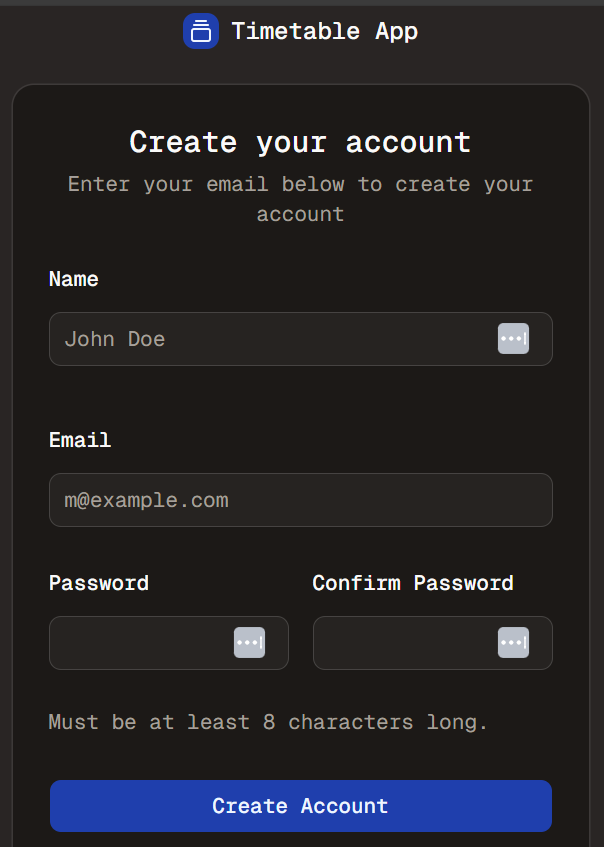

#  Auth Time - Part 6
Welcome to **day 51** of 365 days of code - coding every day for a year, little and often

A pretty short day today, alot of other priorities, but I did manage to get the basic form for the signup flow in place (thanks shadcn). There's nothing in the back end yet, but at least I have something to work form now.

I have also been having a look at better auth and am temtped to switch over to that, it seems like it handles some stuff a whole lot better (auto sign in on account creation etc.), but that will definitely be a project for another week, I'm probably a bit pot committed at this point for the initial delivery of auth.

Anyway, more tomorrow!

> [!NOTE]
> For this timetable project I won't be copying the whole codebase into this repo every time I work on it, instead I'll just [link to the repo](https://github.com/ASam08/timetable-app) and even link [direct to the commit here](https://github.com/ASam08/timetable-app/commit/cf8eeed1925d9b85534d3abcb21d45c7b4e0bc9e) if someone wants to go have a look at that point in time.

