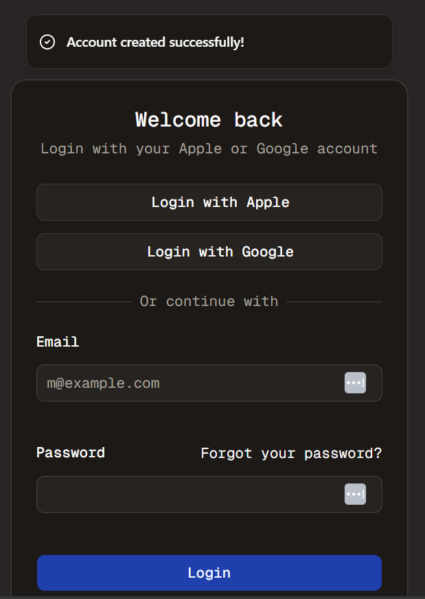

#  Auth Time - Part 9
Welcome to **day 54** of 365 days of code - coding every day for a year, little and often

Another day, another...auth? Today was spent doing some of the tidy up work mentioned yesterday. I've now got the validation mostly where I want it, a little toast notifcation for a successful sign up and redirect to the sign in page. Auth is pretty much ready to go!

I just want to do one last piece which will be to add an ENV variable for auto approved sign-ups. I mentioned before that I want to manually approve sign ups when I'm piloting this app, so I'll be setting that to on and then manually approving in the DB. Yes I probably want some sort of UI for that instead of making changes in the DB directly, but it's not a fully polished product yet, so I'm happy with a little grey in that respect.

Anyway, more (hopefully a finished PR too) tomorrow!

> [!NOTE]
> For this timetable project I won't be copying the whole codebase into this repo every time I work on it, instead I'll just [link to the repo](https://github.com/ASam08/timetable-app) and even link [direct to the commit here](https://github.com/ASam08/timetable-app/commit/a3483e3f620707bc6f0adc5a2f1e8ca86c38eda2) if someone wants to go have a look at that point in time.

