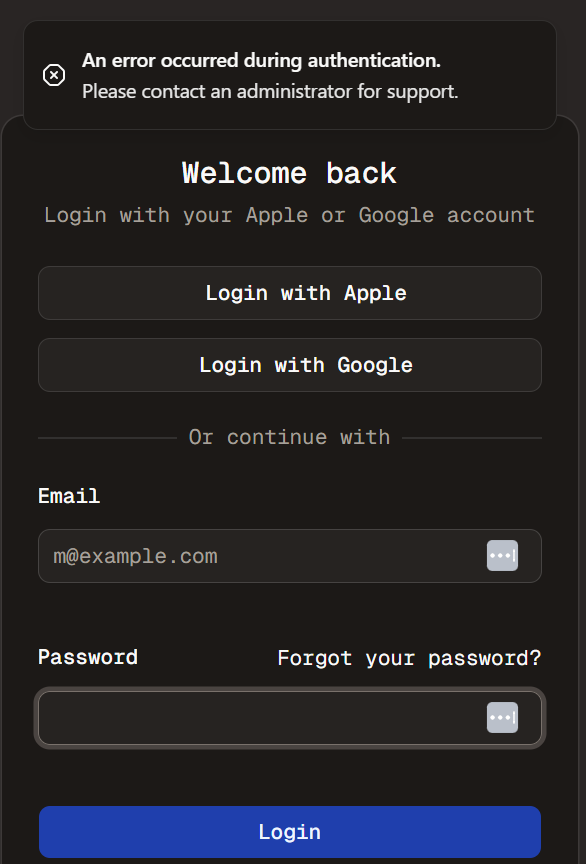

#  Auth Time - Part 10
Welcome to **day 55** of 365 days of code - coding every day for a year, little and often

Wow today has been a frustrating time! I decided it was a good time to implement the ability to turn on and off auto enabled new accounts, as I want it disabled in my pilot. All well and good, the flow to do that is pretty straight forward. However can I get a message to pop up to the user to say that is why they can't sign in? Not for my life...

After many many many failed attempts, I've left it using a generic error message, something I can look at a little bit further, and I can at least add a console log to say that's why so hopefully that will help the admin to diagnose.

Thinking about it further as I write this, maybe I should use the toggle for auto enabling to set the users to enabled or not in the db during signup, not choosing how the signin flow works... something I should probably change...tomorrow

> [!NOTE]
> For this timetable project I won't be copying the whole codebase into this repo every time I work on it, instead I'll just [link to the repo](https://github.com/ASam08/timetable-app) and even link [direct to the commit here](https://github.com/ASam08/timetable-app/commit/aea5311632568c1e38efba0d1f8888f501699bcc) if someone wants to go have a look at that point in time.

