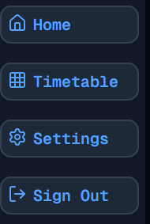
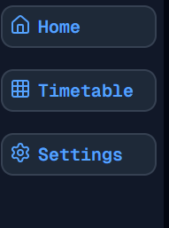

#  Tidying Up
Welcome to **day 57** of 365 days of code - coding every day for a year, little and often

As mentioned yesterday, I had a bit of a tidy up list to work through, so that's what I did today:
- Hid the signout button when auth is disabled
- Hid the OAuth signin buttons from the signin form
- Redirected the signin and signup pages to the dashboard when auth is disabled

And...that's it, a pretty straightforward day, I guess all I can say is, more tomorrow!

> [!NOTE]
> For this timetable project I won't be copying the whole codebase into this repo every time I work on it, instead I'll just [link to the repo](https://github.com/ASam08/timetable-app) and even link [direct to the commit here](https://github.com/ASam08/timetable-app/commit/dfdd1fa90bf1d66d89c4c5dcbbfbdd2909a4cee0) if someone wants to go have a look at that point in time.

 