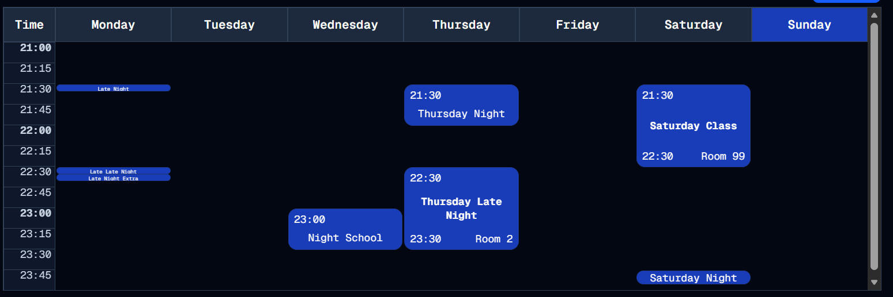

#  Just Get In The Middle
Welcome to **day 60** of 365 days of code - coding every day for a year, little and often

Today was a day of frustration at CSS. Sometimes the answer is just staring you in the face and you can't see it, so thank goodness for chatGPT for giving me the answer I needed. If I'm honest, it's how I see AI being useful for developers, not as something that just spits out all the code for you (what's the point?), but as something to help as a second pair of eyes, troubleshooting stuff when you're too deep in the weeds to see the trees, or to run things past when you're not quite sure. You can't rely on it to always be accurate, but it is good at stepping back and getting out of the emotion (frustration!).

Anyway, I'm pretty please with how this is looking now. Sure if you add a 5m block, the text is very very small, but then it's only a small block so...better than nothing? There's also a fix in here for an issue with the add timetable block still redirecting back to the timetable page even when there is a set created, and also a bit of a change to the new user flow on the timetable page. Instead of showing all the buttons, it just has the add a timetable set button now.

Anyway, more tomorrow!

> [!NOTE]
> For this timetable project I won't be copying the whole codebase into this repo every time I work on it, instead I'll just [link to the repo](https://github.com/ASam08/timetable-app) and even link [direct to the commit here](https://github.com/ASam08/timetable-app/commit/f6fe4261deebf91b68d20fd9404fbd964e43c4e6) if someone wants to go have a look at that point in time.

