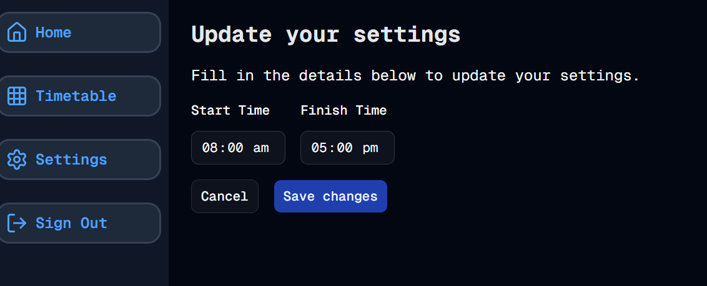

#  Settings - Part 1
Welcome to **day 61** of 365 days of code - coding every day for a year, little and often

Ok, after the success of the auth project, I'm not wanting to kick into adding some customisation for users, and so...settings...

Today was a fairly big chunk of the set up, with the DB table creation, backend logic to query and update the DB all handled, as well as a rough initial implementation of the form with two initial settings; start time and end time.

Right now these aren't actually being read anywhere, but the idea is going to be to allow users to customise the timetable page to show only the window they want. I'm also thinking to allow hiding certain days of the week (e.g. weekends), and I'm sure other stuff will come up. 

I've made the call to store these as individual rows in the DB for each setting, with a setting key and value pair. I think this probably gives me more flexibility later on without having to add extra DB fields or tables, but I guess we'll see how that goes.

I do need to think about a better way to update these, rather than an individual DB call to both pull and update every setting on the page, but that's a future me problem. I'm also passing the userid from the form instead of getting if from the server, this is a bit of a no-no so I need to fix that up later, I just wanted something working for right now.

Anyway, more tomorrow!

> [!NOTE]
> For this timetable project I won't be copying the whole codebase into this repo every time I work on it, instead I'll just [link to the repo](https://github.com/ASam08/timetable-app) and even link [direct to the commit here](https://github.com/ASam08/timetable-app/commit/16b584695803b9f90e250adcd554778b2e45b01c) if someone wants to go have a look at that point in time.

