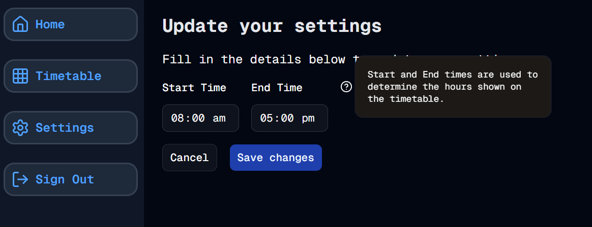

#  Settings - Part 2
Welcome to **day 62** of 365 days of code - coding every day for a year, little and often

We're into the 3rd month of this coding commitment now, and well into the second month of this next.js project, and things are starting to feel a bit more natural for pumping out small, complete pieces of code. I'm also feeling more comfortable with improving on things, and recognising when there might be a better way. 

Today for example, I realised that it might be better to retrieve all of the settings in one DB call, then put them into a key/value pair array and call the relevant setting that way. One DB call, all of the data I need. I think this will work in a few places well, both the settings page and the timetable page are places where I will want a lot of settings at once. So far I have the start and finish times, but I'll later want to pull in whether or not to show each day of the week.

Anyway, this was actually pretty simple to implement, using mapping off the back of the raw data retrieval. I also then went and set the timetable page up to respect these settings, which works really well.

Lastly, I added a hover card explainer to the settings page for the start/finish times.

One more thing I want to do on the times tomorrow, validation, and then I'll be ready to look at the days stuff, or something else maybe. I also wonder if there is a way to update the settings in bulk too, something to think about.

Anyway, more tomorrow.

> [!NOTE]
> For this timetable project I won't be copying the whole codebase into this repo every time I work on it, instead I'll just [link to the repo](https://github.com/ASam08/timetable-app) and even link [direct to the commit here](https://github.com/ASam08/timetable-app/commit/35c9e629fed347f4db3ae1a343988fd56b8dd13c) if someone wants to go have a look at that point in time.

