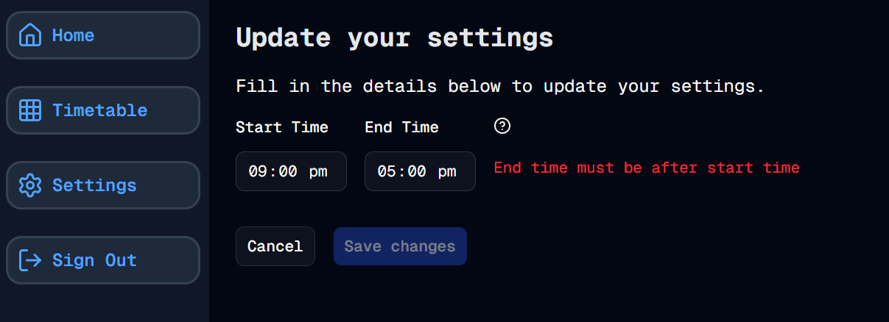

#  Settings - Part 4
Welcome to **day 64** of 365 days of code - coding every day for a year, little and often

Another good update today, adding in the validation for the start and end time fields on the settings page. I've validated that they are both time strings, and also that the end time is after the start time, as I'm pretty certain this app can't time travel (yet?)...

I also added in some user feedback if this happens. While I initially added this in from the server side, I also thought it would be good to provide some instant feedback to the user and provide it client side too, whilst disabling the submit button. In theory that means that the server side check shold never be called, but if someone does try and force it through somehow, the server side validation will catch it, stop it, and still display a nice message to the end user.

And that's all there is today. I ran out of time, but I do want to add a toast notification when the settings have been updated, and then start on the weekday settings.

More tomorrow!

> [!NOTE]
> For this timetable project I won't be copying the whole codebase into this repo every time I work on it, instead I'll just [link to the repo](https://github.com/ASam08/timetable-app) and even link [direct to the commit here](https://github.com/ASam08/timetable-app/commit/8788065b4a9d8b190729d64eee47d1fb6f16247b) if someone wants to go have a look at that point in time.

