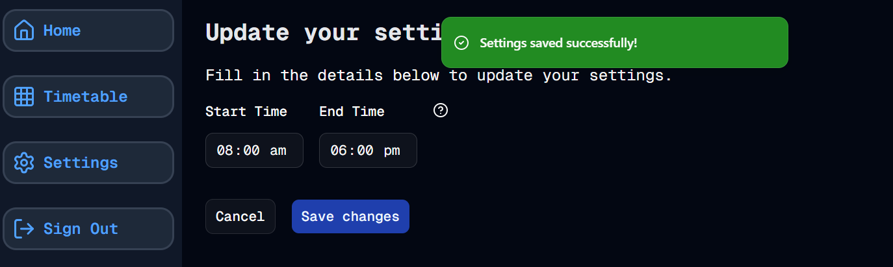

#  Settings - Part 5
Welcome to **day 65** of 365 days of code - coding every day for a year, little and often

A pretty quick day today again, implementing the toast notification after the settings save. After a little bit of working out, I eventually had this in and running, and I'm pretty happy with the result. It has made me think that I should look at doing this for the add blocks form as well, but that's a job for another day.

Having the toast piece done now, I've done the PR and merged the branch in, with the initial release of the settings piece. I'll add the day of week choice into a future branch/feature, for now it's just good to be another step closer to being ready for the initial release.

Next up will be to rebrand it to the new name I've been looking at, and get the project README looking...well not the default...

Possibly not a lot of code in that piece, but there will be some as I tweak the UI to match the naming etc. so, more tomorrow!

P.S. Ok, so when I went to get the screenshot for this update, I realised that the toast message was only showing once per page load. After a little tinkering, I fixed this up, and also a probable future problem about the failed toast messages, so we're now at v0.2.1...now, more tomorrow!

> [!NOTE]
> For this timetable project I won't be copying the whole codebase into this repo every time I work on it, instead I'll just [link to the repo](https://github.com/ASam08/timetable-app) and even link [direct to the commit here](https://github.com/ASam08/timetable-app/commit/d81339d4c3f4a2289b07594355df6f1c95c6cae2) if someone wants to go have a look at that point in time.

