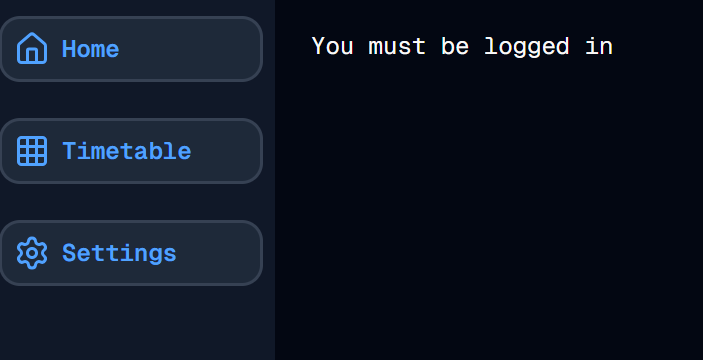

#  A Frustrating Day
Welcome to **day 66** of 365 days of code - coding every day for a year, little and often

Today I wanted to address a bug that I know has been present in the docker version of this app for a while but has been exacerbated by adding in the settings page. For some reason, in the docker build only, and only when auth_on is set to false (or not set), checking for a userId using getUserId, and then checking if it is falsey or null, returns true, meaning it thinks there is no userId...

I honestly cannot work it out, and despite my best efforts today, I still failed.

So honestly, there isn't really much code change today, a few bits of extra logging in the new branch I've created, and changing from !userId to userId === null, but no actual fix... it feels like a bit of a failure to not be producing code, but I guess that's sometimes what coding is, bug fixing, trying and failing and trying again.

So I guess that's it, more tomorrow, maybe a new day can help me spot the issue?

> [!NOTE]
> For this timetable project I won't be copying the whole codebase into this repo every time I work on it, instead I'll just [link to the repo](https://github.com/ASam08/timetable-app) and even link [direct to the commit here](https://github.com/ASam08/timetable-app/commit/022aa6db70cf83ea877f3405b7a76ee9d5ed0a9c) if someone wants to go have a look at that point in time.

