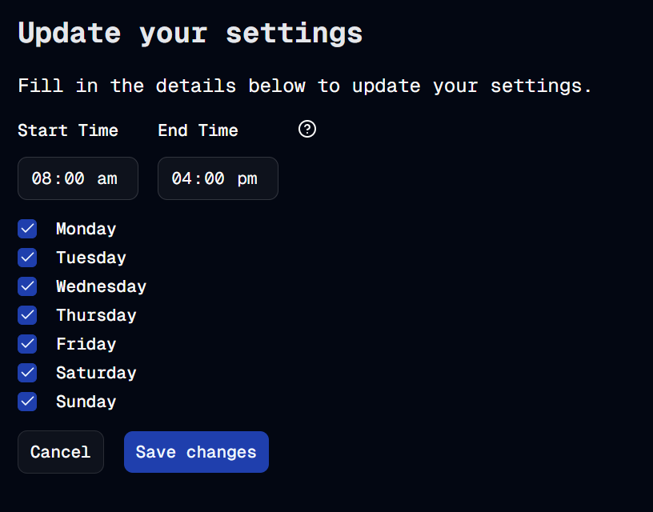

#  8 Days A Week
Welcome to **day 69** of 365 days of code - coding every day for a year, little and often

Another day of incremental change today, and I'm kicking off adding in the day of week settings. The end goal for this is that the user can specify which days of the week they want to show on the timetable page. I don't think I'll stop the user from adding a block for a hidden day, but I might pop up a warning if they do and give them the option to update the timetable to show that day of the week (I only just thought about that while I was writing it,but it sounds like a good idea!).

Anyway, today was just a case of getting the basic bones of it down. It was an opportunity for me to think about the best way to do it, I didn't really want to (or think it was good practice to) write out a code block for each of the 7 days of the week, so a good chance for me to think about efficiency in code, and something where I want them all to always look the same, it made sense to use the map function available to me.

A little hiccup from my default settings yesterday, I didn't really think about the fact that I was mixing types in my settings, so I've shifted the days into their own constant so that I could give the whole constant a boolean type for the value.

And that's it for today folks, more tomorrow!

> [!NOTE]
> For this timetable project I won't be copying the whole codebase into this repo every time I work on it, instead I'll just [link to the repo](https://github.com/ASam08/timetable-app) and even link [direct to the commit here](https://github.com/ASam08/timetable-app/commit/cc5a01401b1fa6b165eb30ed0c53f62ed5cddded) if someone wants to go have a look at that point in time.

