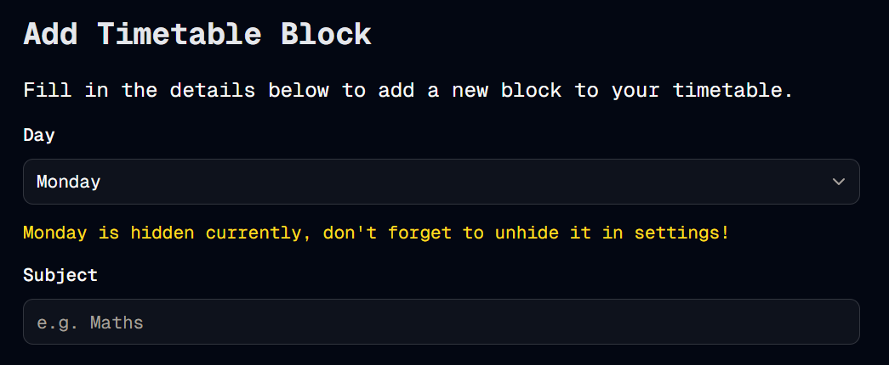
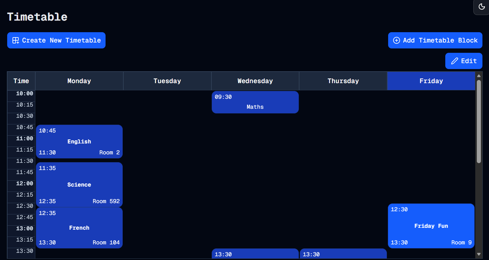

#  Commit Commit Commit
Welcome to **day 72** of 365 days of code - coding every day for a year, little and often

Ok, after the learning yesterday, and the goal to commit more often for each piece of work done, today has been a mega day of multiple commits. It's also handy to see exactly what I've done:
- Make the timetable grid adjust the days of week shown depending on the user settings
- Optimisation for getting the day of week index for events
- Optimisation for getting the day of week array
- Replace dow array with one from the constants file
- Add a warning to the add timetable block page if the user is adding a block to a currently hidden day

Not bad at all. The big win for me was getting the timetable grid to adjust to the days of week set in the settings (kind of the whole point of the feature). From there, I remembered about useMemo, and added that in a few spots for some optimisation (I *need* to do this in a few other places in the app for sure). 

Then I got to work on the timetable block page. I want to eventually add some sort of modal that pops up and asks the user if they want to unhide the day if they are trying to add a block to a currently hidden day. I didn't get that far today, but I did add a warning into the form if a user is adding a block to a currently hidden day. It won't stop them, but it will warn them at least. While I was on the timetable block component, I also spotted an array that I had put into the component itself, it was super easy to swap this out to one of the already existing ones in the constants file (Win!).

Anyway, super happy with the progress today, having the smaller commits did save me once when I started going down the wrong turn on the timetable page with something else, I could restore to the latest commit, reset and continue. It also made me feel like I was achieving a lot, while also being able to step away after a smaller chunk if needed. Great change, I'll need to be wary of forgetting it.

More tomorrow!

> [!NOTE]
> For this timetable project I won't be copying the whole codebase into this repo every time I work on it, instead I'll just [link to the repo](https://github.com/ASam08/timetable-app) and even link [direct to the commit here](https://github.com/ASam08/timetable-app/commit/670011c746f63c3dd6add5527af029c02f249526) if someone wants to go have a look at that point in time.

