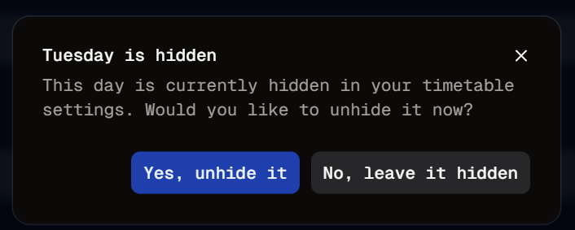

#  Slow And Steady
Welcome to **day 73** of 365 days of code - coding every day for a year, little and often

A pretty light day today, I've been out for the count with a nasty gastro bug, but managed to get a little bit done, slow and steady wins the race right?

So today I got the dialog box for the warning put together. Basically it will pop up if the day of week is hidden upon submit. I haven't got all of the logic together for that just yet, so at the moment, it's just a manual button to show it, just to validate it looks and works ok.

I also haven't gotten the settings update piece going, just the UI for now, all of the rest is to come.

Anyway, more tomorrow!

> [!NOTE]
> For this timetable project I won't be copying the whole codebase into this repo every time I work on it, instead I'll just [link to the repo](https://github.com/ASam08/timetable-app) and even link [direct to the commit here](https://github.com/ASam08/timetable-app/commit/bfa20ea9db3f654d9d6082fef6a98fe49734e934) if someone wants to go have a look at that point in time.

