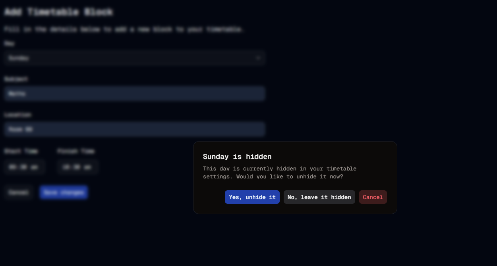

#  Unhide It
Welcome to **day 75** of 365 days of code - coding every day for a year, little and often

75 days of coding feels like another milestone today, especially with some of the challenges lately, so I'm celebrating that a little. And today the progess has been small again but real. The "Yes, unhide it" button on the alert dialog for the add block page now works (hooray!). With that now working, I've also removed the temporary client side validation I had in place for this.

The only thing left to do now is to add in the client side validation for the rest of the form, not a big deal to do, I just need to sit down and get through it, but it will be a job for tomorrow for me.

Catch you then!

> [!NOTE]
> For this timetable project I won't be copying the whole codebase into this repo every time I work on it, instead I'll just [link to the repo](https://github.com/ASam08/timetable-app) and even link [direct to the commit here](https://github.com/ASam08/timetable-app/commit/2995da43399545b811d8490c70428d4a536d7dd5) if someone wants to go have a look at that point in time.

