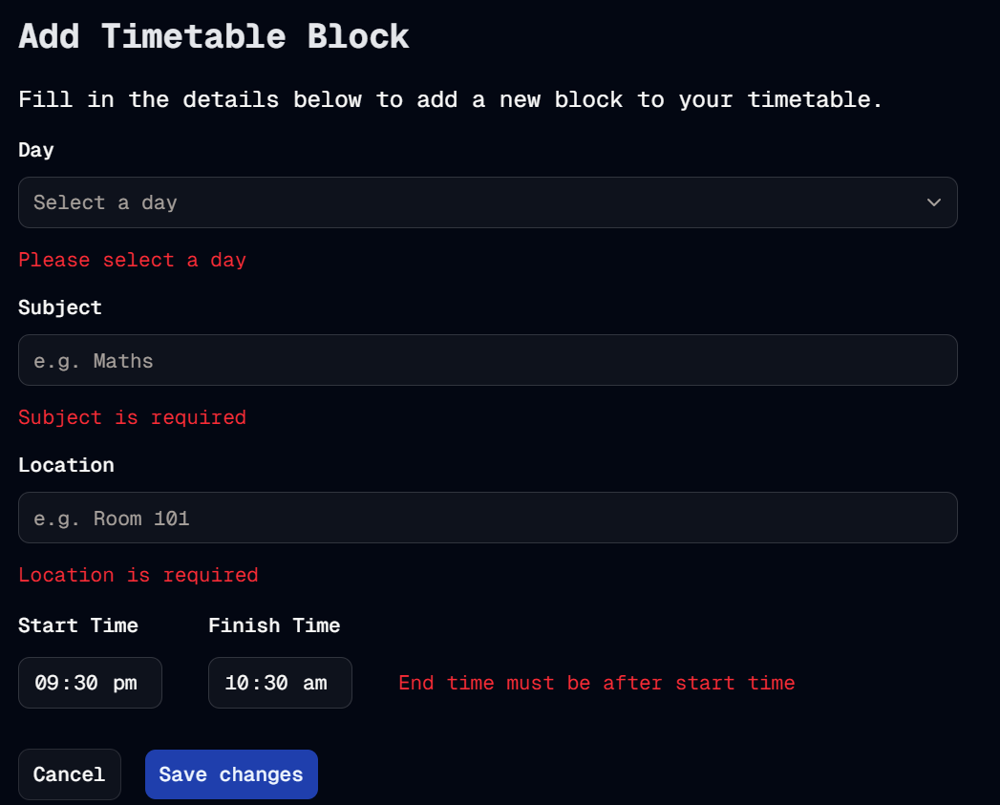

#  Day Of Week Done
Welcome to **day 77** of 365 days of code - coding every day for a year, little and often

And just like that, the day of week feature work is done and released. Today was just adding in the client side validation for the add block form. In my head I originally wanted to disable the submit button until the form was filled out fully, but then I realised, if they can't click the button, I can't give them feedback that they haven't filled the form out fully as the form won't know that they think they have (giving me flashbacks of that Friends scene...). So I pivoted (pun not intended) and added the validation to happen when the submit is clicked, before the day of week check and the actual data submission (and further validation). 

It feels like a lot of validation, but right now I can't think of a better way to do it. There almost certainly is a better and more elegant way to do it, but maybe that's for future me to work out.

Anyway, I guess I'll be back with more tomorrow, not sure quite what I'll work on yet, but I'll find out then!

> [!NOTE]
> For this timetable project I won't be copying the whole codebase into this repo every time I work on it, instead I'll just [link to the repo](https://github.com/ASam08/timetable-app) and even link [direct to the commit here](https://github.com/ASam08/timetable-app/commit/003e5e977712760c5474b98d4e1b37e9b64cb362) if someone wants to go have a look at that point in time.

