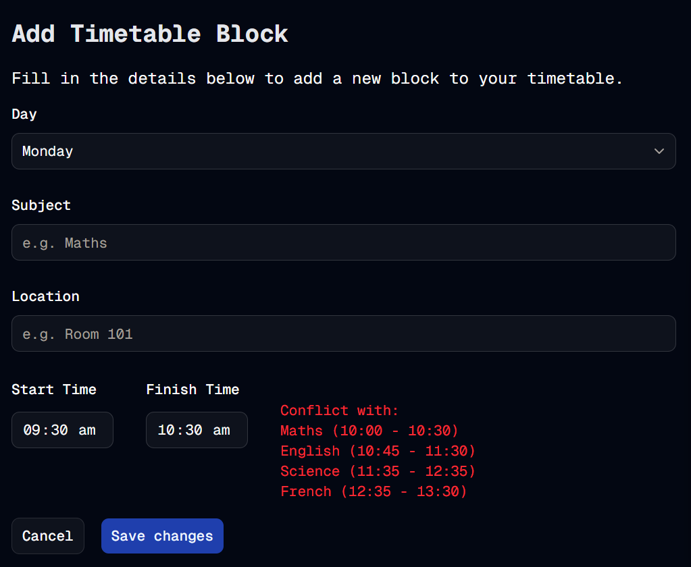

#  One Block At A Time
Welcome to **day 79** of 365 days of code - coding every day for a year, little and often

Today I kicked off the next piece I want to implement, preventing the user from being able to submit a block that clashes with another one. This looks terrible in the timetable grid when it happens, and as we all know, unless you have a time-turner, you can't be in two places at once.

Anyway, I wrote the query to use for the DB check, added it as part of the add-block action, so the add block will fail if there is a conflict, and it gives some useful feedback to the user if this happens, saying what the clash(es) are.

I have got a few minor issues I'm trying to work through with state overloads, I just ran out of time and brain power today to sort them out, so something for me to spend some time on tomorrow, before calling this quick "feature" done (hopefully). I've also realised that the form isn't retaining it's submitted data after it's submitted if there's an error, which isn't a great experience, so I'll take a look at that too.

More tomorrow!

> [!NOTE]
> For this timetable project I won't be copying the whole codebase into this repo every time I work on it, instead I'll just [link to the repo](https://github.com/ASam08/timetable-app) and even link [direct to the commit here](https://github.com/ASam08/timetable-app/commit/dd031361b46c1760ae7739edd5fb79723b250f3a) if someone wants to go have a look at that point in time.

